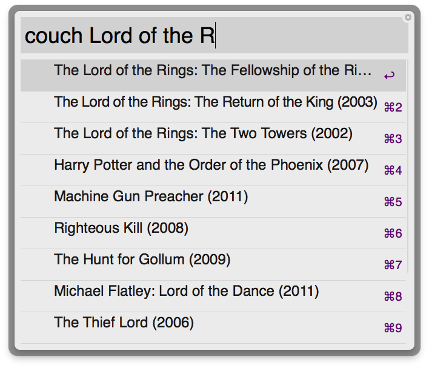

CouchPotatoWorkflow
===================

Alfred 2 Workflow to easily add movies

To setup you need to do `couch_set http://localhost:5050 YOUR_APIKEY_HERE` first.
Your apikey can be found in the CouchPotato settings > General (advanced).

To add a new movie just search using `couch your movie name`

You can also add it as a fallback search under Alfred Preferences > Default Results > Setup fallback results (at the bottom)
